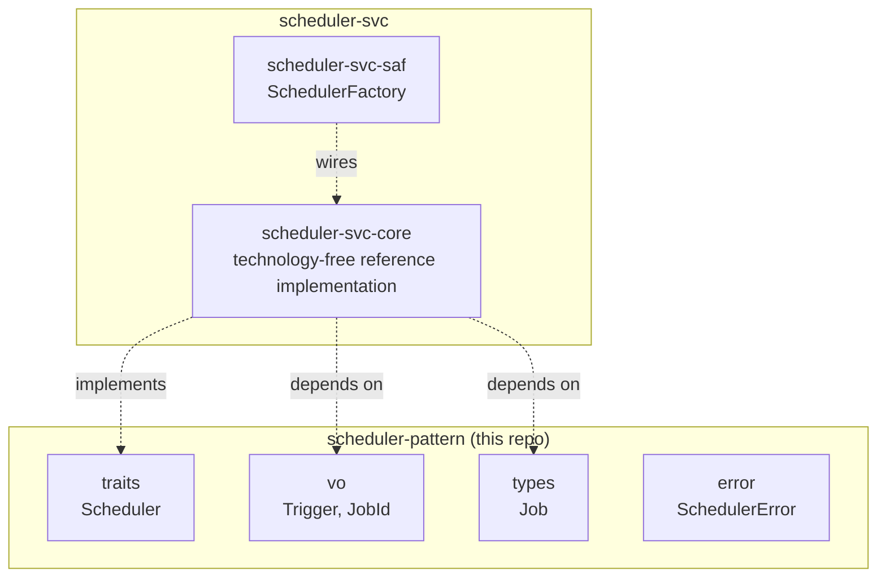

# scheduler-pattern Architecture

**Audience**: Architects, technical leads, contributors.

## Overview

One crate, `scheduler-pattern` — this domain's primitives, zero
implementation, zero knowledge of any specific scheduling backend:

- **`traits/`** — `Scheduler` (`schedule(trigger, job) -> JobId`,
  `cancel(job_id)`).
- **`vo/`** — `Trigger` (`Once(Duration)` / `Every(Duration)` — when to
  run), `JobId` (opaque handle, wraps `Uuid`).
- **`types/`** — `Job` (`Arc<dyn Fn() -> BoxFuture<...> + Send + Sync>` —
  the callable unit of work).
- **`error/`** — `SchedulerError` (`InvalidTrigger`, `ScheduleFailed`,
  `CancelFailed`, `JobNotFound`, `JobFailed`).

Everything that would make this crate aware of a specific scheduling
technology — an in-process timer wheel, a persistent job store, a
distributed cron service — lives in
[`scheduler-svc`](https://github.com/sweengineeringlabs/scheduler-svc)
instead.

## Component Diagram

## Why `Trigger` has only `Once`/`Every`

See [ADR-001](adr/ADR-001-contract-first-domain-design.md). Cron-expression
syntax (`"0 9 * * MON-FRI"`) is a materially larger feature — parsing,
timezone handling, DST — that no real consumer has needed yet. `Once`/
`Every` cover the well-understood 80% (run later, run periodically) without
guessing at syntax nobody has validated. Adding a `Trigger::Cron(String)`
variant later is additive, not breaking.

## Why `Job` is `Fn`, not `FnOnce`

A `Trigger::Every` job fires repeatedly — it must be callable more than
once. This is a genuine, structural difference from the two adjacent
domains that might otherwise look similar:

- `message-broker-pattern`'s `Task`/`TaskQueue`: a `Task` payload is
  consumed exactly once by whichever competing consumer dequeues it.
- `executor-pattern`'s `Executor::run<F: Future>`: one future per call,
  `FnOnce`-shaped by construction (a `Future` itself only resolves once).

`Job`'s `Fn` bound, wrapped in `Arc` (shareable across however many times
the trigger fires, from whatever thread the backend schedules it on), is
what those two domains' shapes don't need and this one does.

## Why `Job`'s double-boxing (`Arc<dyn Fn() -> BoxFuture<...>>`) is kept

Raised as a zero-cost abstraction question in
[scheduler-pattern#2](https://github.com/sweengineeringlabs/scheduler-pattern/issues/2):
`Job` heap-allocates once for the `Arc<dyn Fn>` itself and once more for the
`BoxFuture` each invocation returns. Checked against the actual requirement,
not assumed either way:

`Scheduler::schedule` must accept jobs of genuinely different concrete
closure types — a caller schedules a `Once` job that sends an email, another
schedules an `Every` job that polls a queue, a third does neither — all
stored in the same backend's internal job table. That is heterogeneous
storage by construction: a `Scheduler` implementation cannot know at compile
time what concrete closure type any given `schedule` call will pass, so
there is no monomorphizable shape for `Job` that keeps them distinct.
`Arc<dyn Fn(...) -> BoxFuture<...>>` is the correct tool for that, not a
shortcut — the same reason `std::thread::spawn`'s closure parameter and
any GUI event-callback registry end up boxed too.

The cost is also genuinely small at this call frequency: `schedule` runs
once per job registered, and each job's own future is only polled once per
`Trigger` firing (seconds-to-days apart for any real interval, not a tight
per-message hot loop like `MessageBroker::publish` or
`TransactionalStore::get`). Two heap allocations at that frequency are not
worth trading away the ability to schedule arbitrary closures for.

**Conclusion**: `Job`'s shape is kept as-is. `Scheduler::schedule`/`cancel`
themselves already return `Result` directly with no boxed future at all —
the trait's own hot-path methods were never the problem; `Job`'s boxing is
inherent to what a job registry has to store, not a needless one.

## Why no `Validator` trait (yet)

`message-broker-pattern` and `executor-pattern` both declare a `Validator`
trait for their respective `-svc`-side backend config types to implement.
`scheduler-pattern` declares none — there is no backend config type yet to
validate (`scheduler-svc` starts with `core` only, which needs no runtime
parameters). Adding `Validator` before a real config type exists to
validate would be speculative machinery with nothing to attach it to; see
ADR-001's own "contract-first is not unconstrained scope" principle.

## Scope boundary

This repo covers exactly `Scheduler` (schedule/cancel time-triggered jobs).
Not covered:

- **Cron-expression triggers** — see "Why `Trigger` has only `Once`/`Every`"
  above.
- **Distributed task queues** (enqueue work, workers pick it up
  immediately, no time component) — already `message-broker-pattern`'s
  `TaskQueue`.
- **Executor/runtime selection** (which async runtime drives a future) —
  already `executor-pattern`'s `Executor`. `scheduler-svc`'s own
  implementations may well use an `Executor` internally to run fired jobs,
  but that's an implementation detail of `-svc`, not part of this
  contract.

[← Docs index](../README.md)
